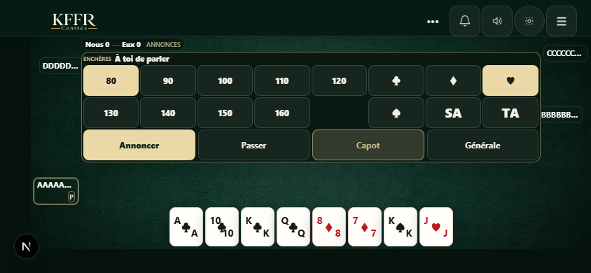
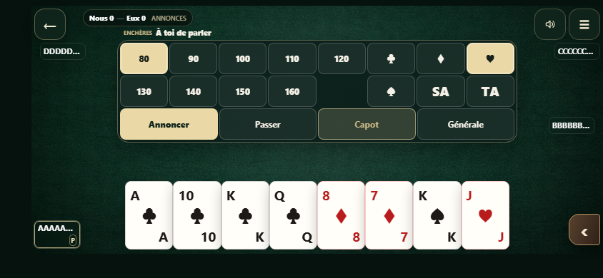
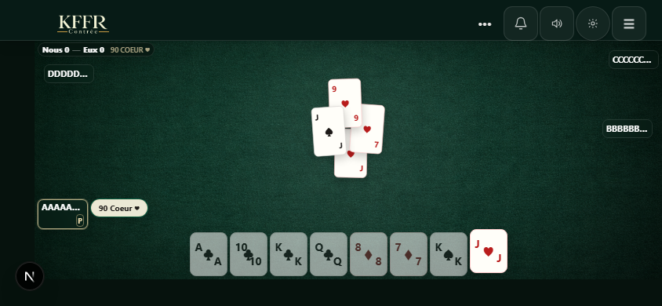
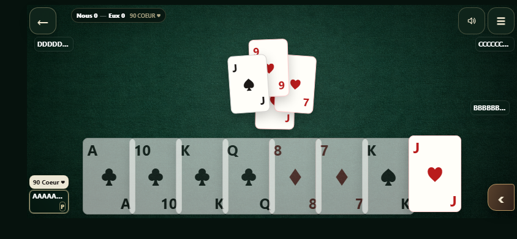
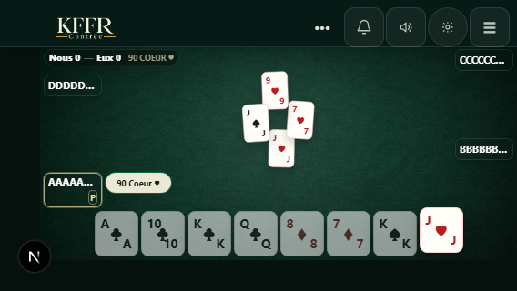
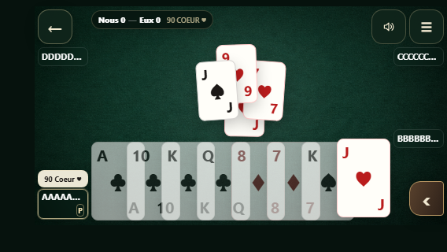
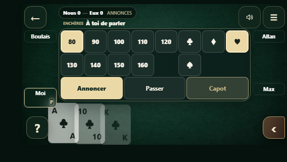
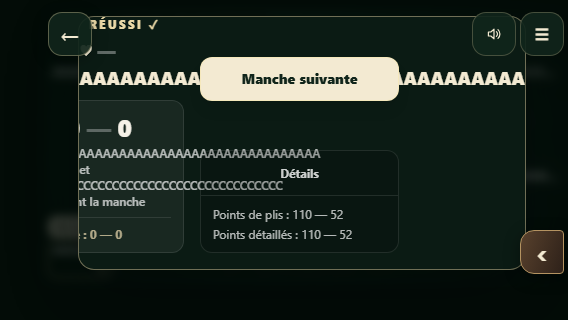

# Table mobile immersive V2

Base : `f3242de` (dernier `main`, PR #138). Branche : `codex/mobile-table-immersive-v2`.

Ce chantier est limité à la présentation de la table partagée Solo / Multiplayer / Training. Aucun fichier moteur, bot, transport, API, RPC, schéma, migration, scoring, présence, matchmaking ou PWA n’est modifié. Les screenshots de référence évoqués dans le brief n’étaient pas joints : les proportions et affordances décrites ont guidé le travail, avec les composants et le tapis KFFR existants.

## Choix UX

- **Mode immersif mobile** : header sans hauteur réservée, logo masqué, contrôles flottants dans les safe areas. L’audio et le drawer restent en haut à droite ; le thème passe dans le menu de partie. Les insets restent réservés une fois par le shell, avec un fond bois sombre dans ces marges. Le portrait conserve l’invitation existante à tourner le téléphone.
- **Retour en haut à gauche** : confirmation via `AccessibleDialog`, puis navigation vers `/`. Solo avertit de la perte d’une partie non connectée ; Training avertit de la fermeture de la séance et de son bilan. En Multi, c’est une sortie de l’écran : elle ne déclare aucun forfait, et conserve les mécanismes existants de présence/remplacement. Le forfait et la redistribution gardent leurs entrées et confirmations existantes.
- **Flèche sur le bord droit** : le bouton du menu de partie existant devient une poignée de bois, placée dans le rail droit à côté de la main. Elle conserve son nom accessible « Menu Partie », `aria-controls`, `aria-expanded`, Escape et la restitution du focus. Elle donne accès aux scores en direct, préférences, règles Solo et actions Multi déjà existantes. Ce choix réutilise une entrée utile, sans inventer une nouvelle navigation ni dupliquer les actions.
- **`?` en bas à gauche** : uniquement Training. Rappel des axes/niveaux de la séance et du déroulement des questions, avec réutilisation de `ValueGuide`. Même aide accessible depuis le menu de partie. La planification, la correction et les pauses pédagogiques restent inchangées.
- **Main** : hauteur distincte entre enchères et jeu, largeur proportionnelle, chevauchement calculé en conservant au moins 44 px exposés par carte. Les tailles restent grandes à 5, 4, 3 et 1 carte. Les préférences, clics, dimming, surbrillance, animations et callbacks existants sont conservés.
- **Pli** : cartes agrandies, cluster par provenance et ordre de rendu inchangés ; une carte seule est centrée. Le ramassage et le dernier pli conservent leurs actions.
- **Enchères** : surface sombre flottante, largeur plafonnée à 560 px, titre hors du corps de la grille sur paysage court. Toutes les grilles de valeurs/modes restent disponibles et les cibles sont ≥44 px.
- **Actions seules** : si les permissions existantes ne permettent plus de choisir valeur/mode/capot/générale, les contrôles indisponibles sont masqués sur mobile. Passer / Contrer / Surcontrer restent reliés aux mêmes callbacks et confirmations ; aucun recalcul métier n’est introduit. Le panneau est plafonné à 360 px.
- **Annonces** : l’existant sélectionne déjà la dernière annonce de chaque joueur puis le contrat final. Cette sélection est conservée ; chips et positions sont allégées, sans ajouter de pile d’historique.
- **HUD / résultat** : HUD flottant dans l’espace entre les contrôles ; backdrop du résultat renforcé, composition en deux colonnes en paysage court, CTA et détails conservés.

## Mesures avant / après

Captures comparables sur une copie isolée de `main` et sur la branche, fixtures identiques, animations désactivées. Safe areas : haut 8, gauche 44, droite 0, bas 34 px. Les dimensions de pli sont les rectangles rendus (rotation comprise). Le header avant inclut les 8 px de safe area ; le gain net de table est bien 44 px.

| Écran | Hauteur table | Carte de main (largeur × hauteur) | Carte du pli (largeur × hauteur) |
| --- | --- | --- | --- |
| 568×320 | 234 → 278 | 48×50 → 68×100 | 29×42 → 52×76 |
| 667×375 | 289 → 333 | 48×56 → 82×120 | 43×63 → 63×91 |
| 844×390 | 304 → 348 | 48×56 → 85×125 | 43×63 → 66×95 |
| 932×430 | 344 → 388 | 48×56 → 95×140 | 43×63 → 68×99 |

Sur 1024×768, 1120×800, 1440×900 et 1280×450 : **écart géométrique mesuré de 0 px** pour table, mains, joueurs et cartes du pli. Le header reste à 56 px. Données exactes : [measurements.json](mobile-immersive-v2/measurements.json).

## Captures

| État | Avant | Après |
| --- | --- | --- |
| Enchères 844×390 |  |  |
| Pli / main 844×390 |  |  |
| Pli / main 568×320 |  |  |

## Validation

- Vitest complet : **191 fichiers, 1948 tests passés**.
- Lint et TypeScript : passés.
- Suite ciblée Chromium finale sur production : **66 tests passés** (nouvelle suite de 17 tests comprise, dont un contrôle du dernier pli Training après une vraie question).
- Suite ciblée WebKit finale sur production : **65 tests passés**, sans crash.
- Suite smoke complète sur production : **89 tests passés**. Les attentes suivent le thème dans le menu mobile et la nouvelle surface sombre des enchères ; les assertions desktop sont conservées.
- Comparaisons avant / après : 8 scénarios par version, les quatre paysages et quatre références desktop/tablette.
- Build production isolé : passé.
- Suite mobile Chromium complète en production : 362 scénarios passés au premier run ; le dernier test a été corrigé pour attendre le chargement de la partie avant de changer le thème. Ce scénario repasse dans la suite finale **66/66**, avec le nouveau test du dernier pli Training. Aucun échec local Chromium restant ; les workflows du SHA final sont détaillés dans la PR.

La matrice inclut les quatre paysages demandés, portraits 390×844 / 430×932, rotation, safe areas des deux côtés et réduction du viewport dynamique, thèmes clair/sombre, texte agrandi, contraste renforcé, mouvement réduit, focus, enchères extrêmes, confirmations, mains 8→1, plis 1→4, ramassage, dernier pli, Training et résultats avec détails.

Les fixtures UI passent par les vraies pages et les composants, sans écrire de données backend. Les sorties vérifient explicitement l’absence d’intention de jeu. Les tests Training existants exercent également une vraie question, sa correction et la reprise du moteur local.

Limites : safe areas / standalone sont simulés ; les captures et moteurs automatisés ne remplacent pas une prise en main sur iPhone/Android physiques. Les scénarios authentifiés réels avec DB sont exécutés par les workflows existants lorsqu’ils sont déclenchés.
